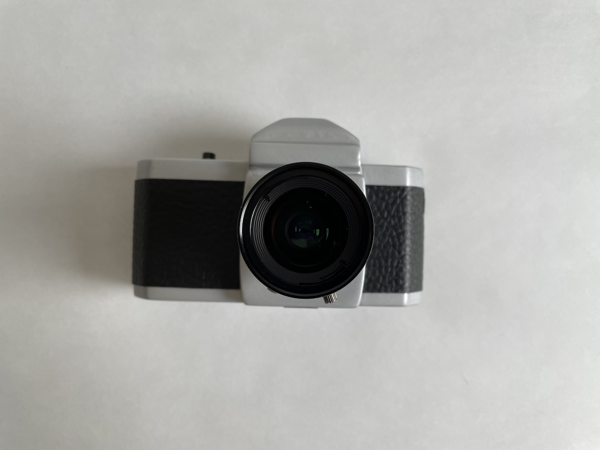

# 📸 ruhha.camera – Benjamin Fork

Modifizierte Version der originalen RUHAcam – eine 3D‑druckbare Retro‑Digitalkamera  
auf Basis des Raspberry Pi Zero WH und der Raspberry Pi HQ Camera.

---

## 🖼️ Vorschau

  
  

---

## 🧩 Features

- Raspberry Pi Zero WH + HQ Camera  
- C‑Mount Objektiv (z. B. 16 mm)  
- 2.2" TFT‑Display (SPI)  
- Shutter‑Button  
- Akku‑Betrieb mit TP4056 + MT3608  
- 3D‑gedrucktes Gehäuse (STL‑Dateien enthalten)  
- Live‑Preview + Bildspeicherung

---

## 🛠️ Hardware

| Komponente           | Beschreibung               |
|----------------------|----------------------------|
| Raspberry Pi Zero WH | WLAN + GPIO                |
| HQ Camera            | C‑Mount Objektiv           |
| 2.2" TFT Display     | ST7789 oder ILI9341        |
| TP4056               | LiPo‑Ladegerät             |
| MT3608               | Step‑Up 3.7 V → 5 V        |
| LiPo Akku            | 2000–5000 mAh empfohlen    |
| Shutter‑Button       | GPIO‑Auslöser              |
| 3D‑Gehäuse           | STL‑Dateien im Repo        |

---

## 🧱 3D‑Druck

STL‑Dateien im Ordner `STL/`:

- `ruhacam-body.stl`  
- `ruhacam-cover.stl`  
- `ruhacam-mount.stl`  
- `ruhacam-top-deco.stl`

**Empfohlene Einstellungen:**

- Material: PLA oder PETG  
- Layerhöhe: 0.2 mm  
- Infill: 20–30 %  
- Supports: nur für Mount

---

## 🔌 Verkabelung

### Display (SPI)

| Display | GPIO             |
|--------:|------------------|
| VCC     | 5V               |
| GND     | GND              |
| SCL     | GPIO 11 (SCLK)   |
| SDA     | GPIO 10 (MOSI)   |
| RES     | GPIO 25          |
| DC      | GPIO 24          |
| CS      | GPIO 8           |

### Shutter‑Button

| Button | GPIO     |
|--------|----------|
| Pin 1  | GPIO 17  |
| Pin 2  | GND      |

### Power

- LiPo → TP4056 (B+ / B–)  
- TP4056 OUT+ / OUT– → MT3608 IN+ / IN–  
- MT3608 OUT+ / OUT– → Pi 5V / GND

---

## 💾 Software
Als letztes müsst ihr die Software richtig einstellen. Hier findet ihr die Code Libarie.
